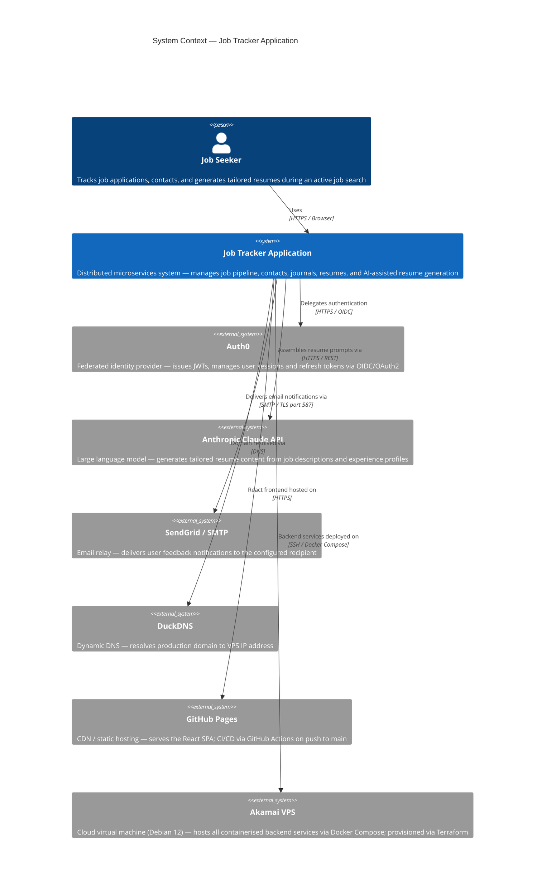
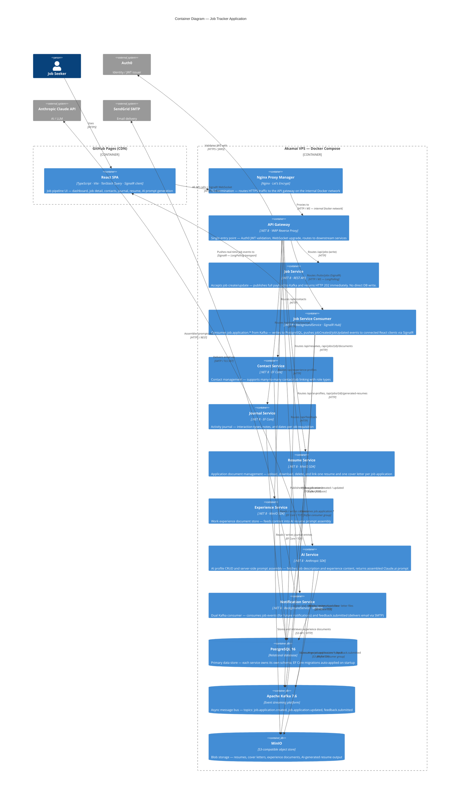

# Reference Architecture — Job Tracker Application

**Version:** 1.0  
**Date:** 2026-05-12  
**Author:** Mark Riggs  
**Status:** Current

---

## Overview

The Job Tracker Application is a cloud-native, event-driven distributed system built on microservices principles. It demonstrates enterprise architecture patterns including API gateway, async messaging, real-time push, federated identity, blob storage, AI integration, and infrastructure as code — all deployed to production on a Linux VPS via Docker Compose, with Kubernetes as the target orchestration platform.

The architecture is documented at two C4 levels: **System Context** (the system and its external dependencies) and **Container** (the internal building blocks and how they communicate).

---

## Level 1 — System Context



---

## Level 2 — Container Diagram



---

## Key Architectural Decisions

| Concern | Decision | Rationale |
|---|---|---|
| Service decomposition | Domain-per-service (polyrepo) | Independent deployability, clear ownership boundaries |
| Write path for jobs | Kafka publish → 202 Accepted, no synchronous DB write | Decouples HTTP response time from persistence; publisher and consumer independently scalable |
| Status updates | Synchronous REST (no Kafka) | Lightweight field update; async overhead not justified |
| Real-time push | SignalR via Job Service Consumer | Consumer owns the DB write and is best placed to signal completion |
| SignalR transport | LongPolling (not WebSocket) | WebSocket frames do not traverse the NPM → YARP proxy chain reliably in this topology |
| Identity | Auth0 (external IdP) | Eliminates credential management, supports OIDC/OAuth2, refresh token rotation |
| Blob storage | MinIO (S3-compatible) | Self-hosted, S3 API compatible — zero vendor lock-in, drop-in replacement for AWS S3 |
| Database strategy | PostgreSQL, schema-per-service | Single engine, isolated schemas; migrations owned by each service |
| IaC | Terraform (Akamai/Linode provider) | VM, SSH key, and firewall declared as code; reproducible provisioning |
| Frontend deployment | GitHub Pages + GitHub Actions | Zero-cost static hosting; CI gates test pass before build |
| AI integration | User-triggered, Claude.ai model first | Server assembles the prompt; user pastes into Claude.ai — no API cost until API model is enabled |

Full decision records: [Architecture Decision Records](../adr/)

---

## Infrastructure Topology

```
Internet
  └── DuckDNS (dynamic DNS → VPS IP)
        └── Akamai VPS :443 / :80
              └── Nginx Proxy Manager (TLS termination, Let's Encrypt)
                    └── API Gateway :8080 (YARP, Auth0 JWT validation)
                          ├── Job Service :8080
                          ├── Job Service Consumer :8080 (+ SignalR hub)
                          ├── Contact Service :8080
                          ├── Journal Service :8080
                          ├── Resume Service :8080
                          ├── Experience Service :8080
                          ├── AI Service :8080
                          └── Notification Service :8080
                                └── [Kafka, PostgreSQL, MinIO — internal Docker network]

GitHub Pages (CDN)
  └── React SPA → all API calls → DuckDNS domain → Nginx → Gateway → services
```

---

## Repository Structure

14 repositories under a polyrepo strategy — each service, the gateway, infrastructure config, shared libraries, and documentation maintained independently.

| Repository | Role |
|---|---|
| job-tracker-app-gateway | YARP API gateway |
| job-tracker-app-job-service | Job domain — Kafka publisher |
| job-tracker-app-job-service-consumer | Kafka consumer, DB writer, SignalR hub |
| job-tracker-app-contact-service | Contact domain |
| job-tracker-app-journal-service | Activity journal domain |
| job-tracker-app-resume-service | Application document management (resumes and cover letters) |
| job-tracker-app-experience-service | Experience document storage |
| job-tracker-app-ai-service | AI profile management, prompt assembly |
| job-tracker-app-notification-service | Notification and email delivery |
| job-tracker-app-user-service | User profile domain (planned) |
| job-tracker-app-web-react | React frontend |
| job-tracker-app-web-angular | Angular frontend (Phase 2) |
| job-tracker-app-infrastructure | Docker Compose, Terraform, Nginx config |
| job-tracker-app-docs | Architecture docs, ADRs, guides |

---

## EA Artifact Index

| Document | Purpose |
|---|---|
| [Executive Architecture Brief](executive-architecture-brief.md) | One-page strategic summary for non-technical stakeholders |
| [Technology Roadmap](technology-roadmap.md) | Phase 1/2/3 capability plan with rationale and governance principles |
| [Engineering Standards & Governance](engineering-standards-governance.md) | Coding standards, API design, ADR process, testing requirements |
| [Security Architecture](security-architecture.md) | Threat model, identity flows, network topology, data classification |
| [Architecture Decision Records](../adr/) | Full decision history — 10 ADRs covering all major technology choices |
